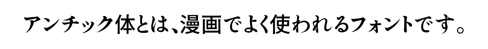

<h2>はじめに</h2>
こちらは今後GoogleFontsに提供するフォントです（まだ修正する可能性があります） 
品質向上のため、デザインについてご意見などいただけますと嬉しいです。

<h2>このフォントについて</h2>
しっぽりアンチックは、大正時代の築地体をもとにして作った「しっぽり明朝」をベースに肉太にして粘りを効かせた仮名と源石ゴシックの漢字を組み合わせた、コミック・漫画の台詞や絵本の文に最適なフリーフォントです。 
同人誌、コミック、漫画や絵本を作られている方に、伝統ある活字をもとにした筆文字感のある正統派アンチック体を極力制限なく使って貰おうという目的で作りました。 
ver3.00では、濁点仮名の追加、基本ASCII＋Laten-1文字の追加、漢字はSILライセンスの源石ゴシックの漢字を収録しました。 

<h2>SIL Open Font License Version 1.1ライセンスについて</h2>

・個人利用・商用利用にかかわらずどなたでも無料でお使いいただけます。 

・ゲームやアプリなどへの組み込みやwebフォントとしての利用も可能です。 

・このフォントを使用し、派生フォントを作ることもできます。 
　ただし、配布の際はSIL Open Font Licenseに基づいてリリースする必要があります。 

・SILライセンスについて詳しくはライセンス原文日本語サイト 
　（https://ja.osdn.net/projects/opensource/wiki/SIL_Open_Font_License_1.1） 
　または同梱の「OFL.txt」（英語）をご確認ください。 

<h2>収録文字</h2>
・基本ASCII＋Laten-1文字 
・ひらがな、カタカナ、全角英数、全角記号、縦書き用文字、濁点仮名 
・漢字はSILライセンスの源石ゴシックのものを収録

<h2>できないこと</h2>
・作成した派生フォントの名前に「しっぽりアンチック」の文字を含めること。 
・「SIL Open Font License Version 1.1」以外のライセンスで再配布すること。 
・フォントファイル自体を単体で販売すること。 

<h2>その他</h2>
ご不明なことやお気付きの点がありましたら作者のメール：fontdasu@gmail.com
または<a href="https://twitter.com/fontdasu" target="_blank">作者Twitter</a>へお問い合わせください。 

<h2>更新履歴</h2>
Ver 3.000 (2020.6.30) 
Glyphsで1から作り直しました。グリフのパスを全て見直しました。濁点仮名を追加。基本ASCII＋Laten-1文字を追加。漢字はSILライセンスの源石ゴシックのものを収録しました。  

Ver 1.100 (2019.1.24) 
一部アプリで三点リーダが欧文用に変更されてしまう問題と合字設定の不具合を修正しました。  

Ver 1.001 (2017.1.16) 
小文字横書き用の「ゥ」に不要な小さなパスがあったのを修正。  

Ver 1.000 (2017.12.17) 
初回リリース。

Ver 1.000 (2017.10.9) 
初回リリース。  

